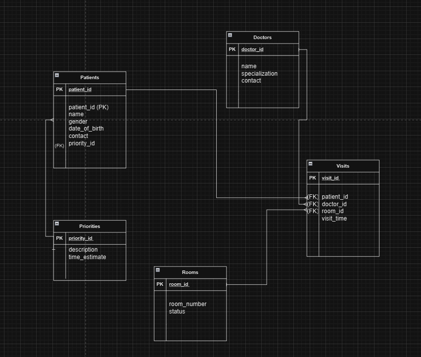

# Hospital Triage Database Design

## Entities Description

### Patients
This entity stores all relevant data about individuals seeking medical attention. It includes personal details and medical triage information.

### Doctors
This entity stores details about medical personnel, including their specialization and contact information.

### Rooms
This entity contains details about the rooms available for patient care. It tracks the room's status and occupancy.

### Priorities
This entity categorizes the urgency of patients' conditions to assist in managing the triage process.

### Visits
This entity links Patients, Doctors, and Rooms, tracking the details of each patient's visit.

## Attributes Specification

### Patients Attributes:
- `patient_id` (INTEGER, PRIMARY KEY, AUTO INCREMENT): Unique identifier for each patient.
- `name` (VARCHAR, 100): Full name of the patient.
- `gender` (VARCHAR, 10): Gender of the patient.
- `date_of_birth` (DATE): Birth date of the patient.
- `contact` (VARCHAR, 15): Contact phone number of the patient.
- `priority_id` (INTEGER, FOREIGN KEY): Links to the `Priorities` table.

### Doctors Attributes:
- `doctor_id` (INTEGER, PRIMARY KEY, AUTO INCREMENT): Unique identifier for each doctor.
- `name` (VARCHAR, 100): Full name of the doctor.
- `specialization` (VARCHAR, 50): Doctor's area of medical expertise.
- `contact` (VARCHAR, 15): Contact phone number of the doctor.

### Rooms Attributes:
- `room_id` (INTEGER, PRIMARY KEY, AUTO INCREMENT): Unique identifier for each room.
- `room_number` (VARCHAR, 10): Room number.
- `status` (BOOLEAN): True if the room is occupied; False otherwise.

### Priorities Attributes:
- `priority_id` (INTEGER, PRIMARY KEY, AUTO INCREMENT): Unique identifier for each priority level.
- `description` (VARCHAR, 50): Description of priority level (e.g., High, Medium, Low).
- `time_estimate` (INTEGER): Approximate wait time associated with each priority level.

### Visits Attributes:
- `visit_id` (INTEGER, PRIMARY KEY, AUTO INCREMENT): Unique identifier for each visit.
- `patient_id` (INTEGER, FOREIGN KEY): Links to the `Patients` table.
- `doctor_id` (INTEGER, FOREIGN KEY): Links to the `Doctors` table.
- `room_id` (INTEGER, FOREIGN KEY): Links to the `Rooms` table.
- `visit_time` (TIMESTAMP): Date and time of the visit.

## Database ERD

