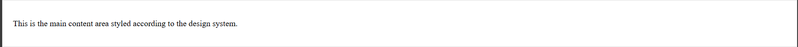

# Design System for My Portfolio

## 1. Color Palette
- **Primary Color**: #007BFF (blue)
- **Text Color**: #555 (dark gray)
- **Border Color**: #ddd (light gray)
- **Background Color**: #fff (white)
- **Accent Color**: #444 (darker gray)

## 2. Typography
- **Body Text**: "Times New Roman", Times, serif
- **Headers**: 'Trebuchet MS', sans-serif

## 3. Components and Layouts

### Header
- Design: Light grey background (#f0f0f0), centered text "My Portfolio".
- Screenshot: 

### Navigation
- Design: Dark grey background (#333333) with white text links.
- Screenshot: 

### Main Content Section
- Design: White background (#ffffff) with a 1px light gray border.
- Screenshot: 

### Footer
- Design: Dark grey background (#333333), centered text in white.
- Screenshot: 

---

## Conclusion
This documentation outlines the design system for the portfolio project, including color schemes, typography, and layout choices, ensuring a consistent design across the portfolio.
